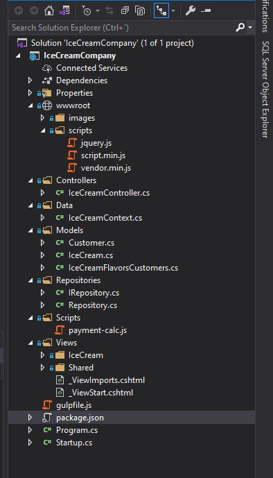
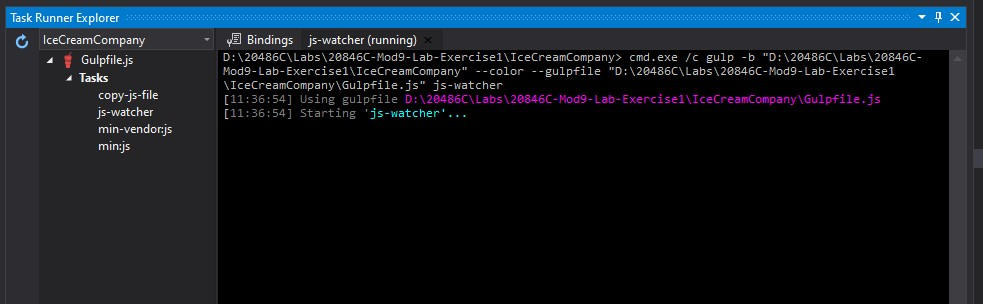

# Module 9: Client-Side Development

## Lab: Client-Side Development

1. **Nombres y apellidos:** Francisco Javier Moreno Quevedo
2. **Fecha:** 02/12/2020
3. **Resumen del Ejercicio:** Añadir los componentes necesarios para hacer funcional la aplicacion de venta de un Zoo 1/4
4. **Dificultad o problemas presentados y como se resolvieron:** Ninguna

- Ejercicio 1: Using gulp to Run Tasks 
  - Instalamos los paquetes
  - Creamos un fichero JavaScript **gulpfile.js** con las tareas de copia
    - Ejecutamos  la tarea
    - Añadimos una nueva tarea que minimice el fichero Vendor.js
    - Añadimos una nueva tarea que ninifique los javascript de una carpeta del proyecto
    - Añadimos un watcher
    - Ejecutamos las tareas

Watcher ejecutandose

